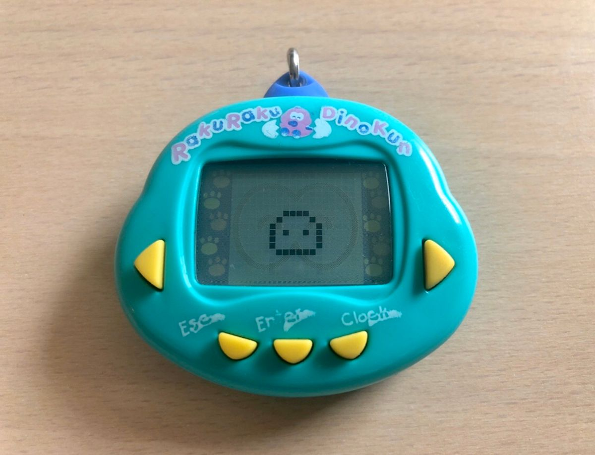
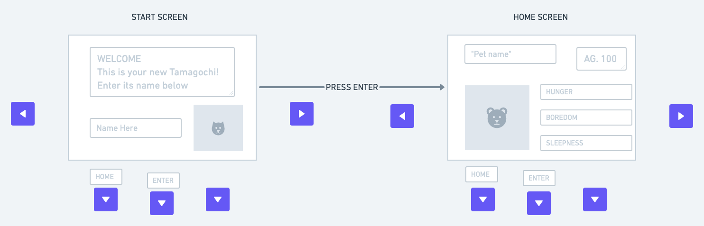
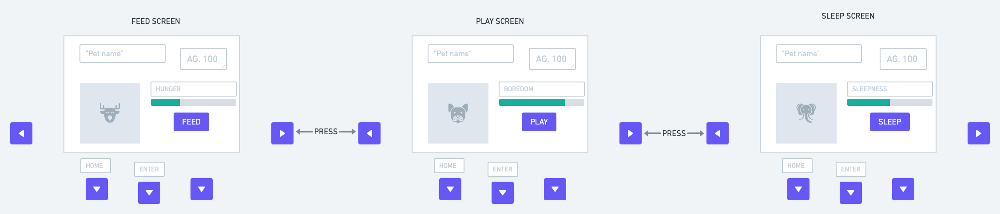

<h1> PROJECT 0 CODENAME TAMAGOCHI: RakuRakuDinoKun Virtual Clone</h1>

<h2>Users stories</h2>

Tamagochi players can enjoy the wonders of taking care of their own Tamagochi. 

Each Tamagochi is going to be a virtually created class, with properties: a name, an age, a meter for hunger, a meter for sleepness, a meter for boredom.

 The Tamagochi's name will be set by the player, and the Tamagochi's age will grow according to a specific timframe with a maximum of 100.

All the meters, which will have a maximum of 10 and a minimum of 0, will affect the Tamagochi's life span, the Tamagochi will cease to live if either one reaches over their extremities.

All of the meters will increase or decrease, over time and according to how the player interact with their Tamagochi:

- hunger:
    - over time it will increase
    - if a player feeds a Tamagochi hunger under 0 their belly will explode
    - if hunger reaches over 10 Tamagochi will died

- sleepness:
    - it will increase over time
    - if it reaches 10 he will sleep forever and died
    - if it reaches 0 he will never sleep again and die

- boredom:
    - it will increase over time
    - if it reaches 10 Tamagochi wil enter a turmoil of despair and die
    - if it reaches 0 Tamagochi will get too excited their heart is going to explode they will die

<h2>Wireframes</h2>

